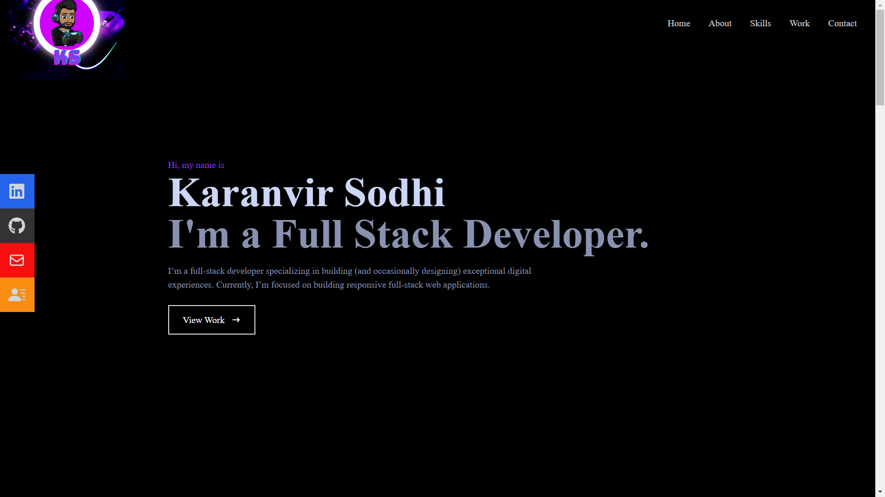

# React Portfolio

# Description
    Our task for this weeks assignment was to create a React portfolio that showcased our react skills as well as make a webpage for future employers to see.  The page is divided up intp sections of the homepage, an about me, skills, projects, and a contact form to reach me.  There is also links to my resume, github, linkedin, and email on the left hand side of the page.

# Usage
The application is used to show information about myself and showcase projects that I have worked on to potential employers.

# Mentions
 I had help from the Web Development Tutors through Northwestern Coding Camp as well as using youtube as a reference

# Links

Github Repo: https://github.com/karsodhi/20-React-Portfolio

Live Link: https://karsodhi-c799eed7ca33.herokuapp.com/

# Screenshot

